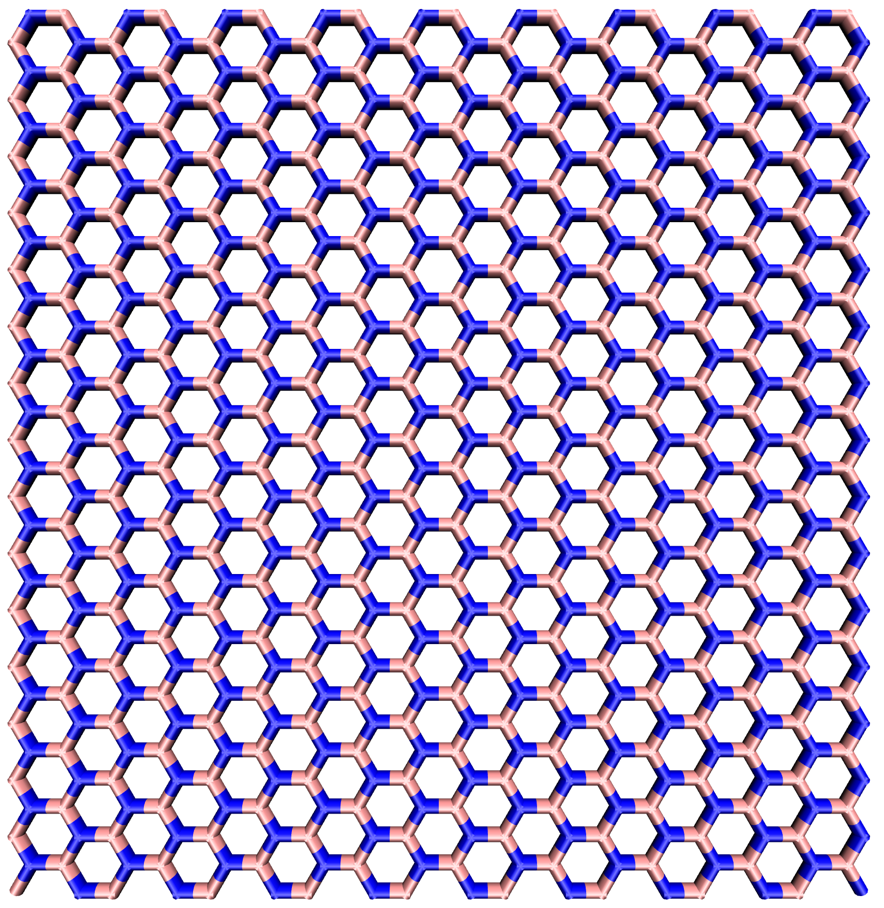
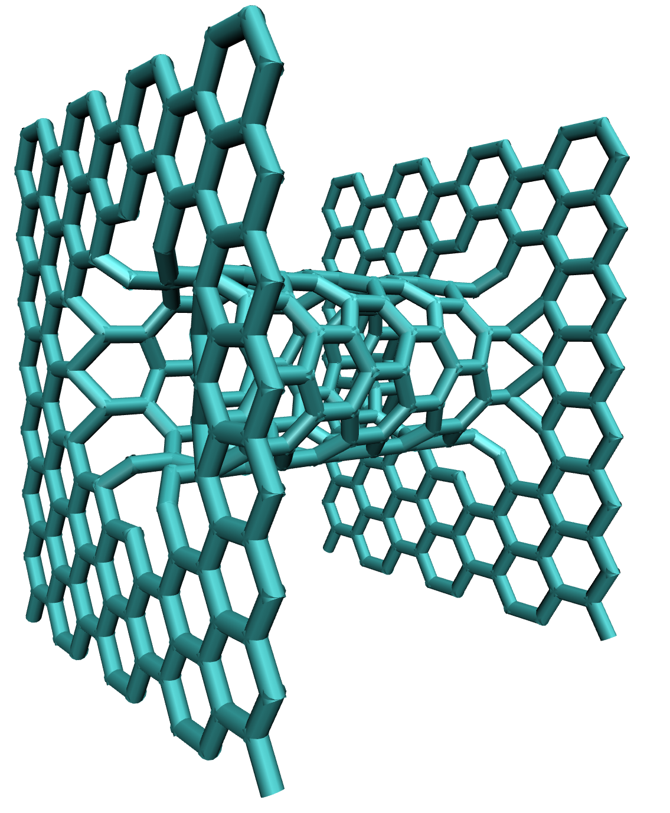

build
=====

The build command is used to build the initial structure. The type of generated structure is controlled using the ``type=`` argument.
Currently available structures:

* graphene  (creates a 2D-graphene sheet)
* boronnitride (creates a 2D-boronnitride sheet)
* cnt (creates a carbon nanotube)
* pore (creates a pore)

depending on which structure is created, different arguments and commands for further customization are available.

Graphene sheet
==============

* ``sheet_size=``

the sheet_size arg sets the dimensions of the sheet in Angstrom. the arg requires two floating point values seperate by a whitespace.
example: ``sheet_size=40.0 40.0``. The default is ``sheet_size=20.0 20.0``.
Keep in mind that the actual sheet size will be lower, since it is determined by the bond_length. The supplied
value represents an upper bound to the size and CONAN will attempt to create the largest possible sheet that fits into these bounds.

* ``bond_length``

the bond_length arg sets the length of the C-C bonds of the sheet. The arg accepts a single floating point value.
example: ``bond_length=1.55``. The default is ``bond_length=1.42``.

example build:

.. code-block:: none

     CONAN-build: build type=graphene sheet_size=40.0 40.0

will yield the following structure:

.. image:: ../../pictures/basic_graphene.png
   :width: 40%
   :alt: Graphene

Boronnitride sheet
==================

has identical build options with graphene sheet.

example build:

.. code-block:: none

   CONAN-build: build type=boronnitride sheet_size=40.0 40.0

will yield the following structure:

Carbon Nanotube
===============

* ``bond_length``

the bond_length arg sets the length of the C-C bonds. The arg accepts a single floating point value.
example: ``bond_length=1.55``. The default is ``bond_length=1.42``.

* ``tube_length=``

specifies the length of the tube in angstrom. The arg accepts a single floating point value.
example: ``tube_length=10.0`` for a 10 Angstrom long tube.

* ``tube_size=``

specifies the width of the tube. The arg accepts a single integer ``m`` and creates a carbon nanotube with the
standard cnt nomenclature cnt(m,m). 
example: ``tube_length=8``

* ``armchair/zigzag``

The conformation of the carbon nanotube can be controlled by either supplying "armchair" or "zigzag" as a keyword.

example build:

.. code-block:: none

   CONAN-build: build type=cnt tube_size=8 tube_length=10.0 zigzag

will yield the following structure:

.. image:: ../../pictures/basic_cnt.png
   :width: 40%
   :alt: Carbon Nanotube

Pore
====

Nanopores are built from two graphene sheets and a nanotube.

* ``bond_length``

the bond_length arg sets the length of the C-C bonds. The arg accepts a single floating point value.
example: ``bond_length=1.55``. The default is ``bond_length=1.42``.

* ``tube_length=``

specifies the length of the tube in angstrom. The arg accepts a single floating point value.
example: ``tube_length=10.0`` for a 10 Angstrom long tube.

* ``tube_size=``

specifies the width of the tube. The arg accepts a single integer ``m`` and creates a carbon nanotube with the
standard cnt nomenclature cnt(m,m). 
example: ``tube_length=8``

* ``armchair/zigzag``

The conformation of the carbon nanotube can be controlled by either supplying "armchair" or "zigzag" as a keyword.

example build:

.. code-block:: none

   CONAN-build: build type=pore tube_size=8 tube_length=10.0 zigzag

will yield the following structure:

