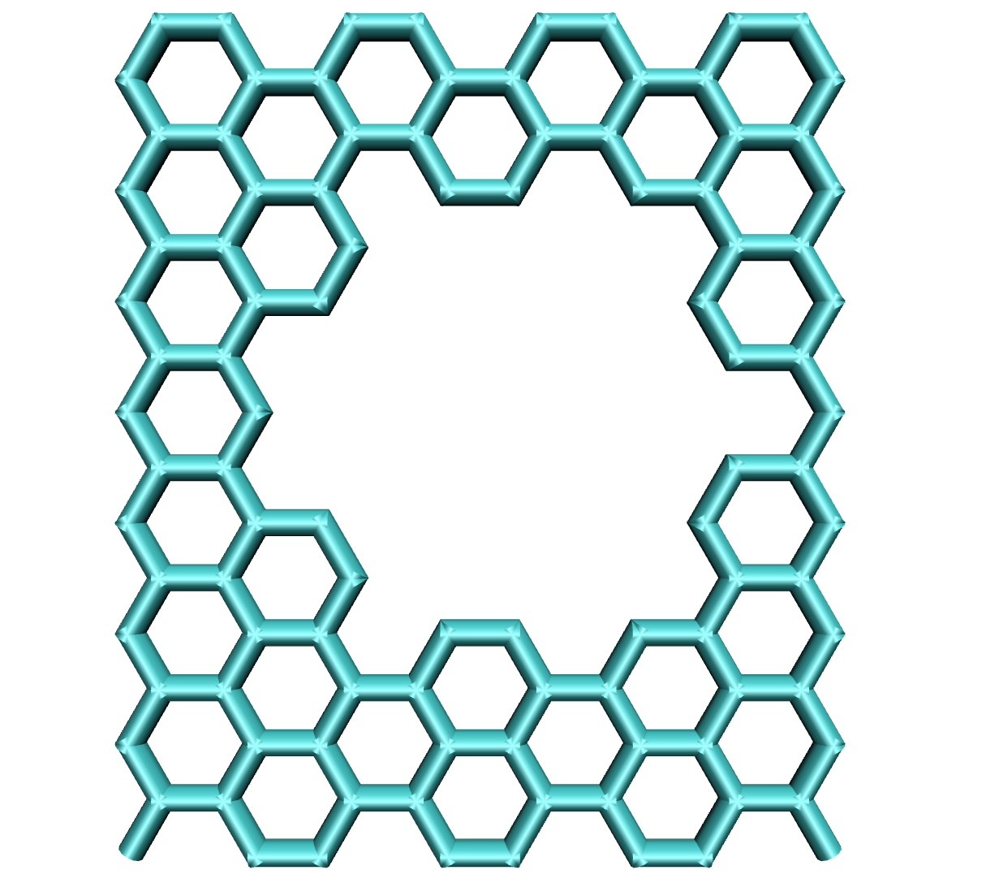
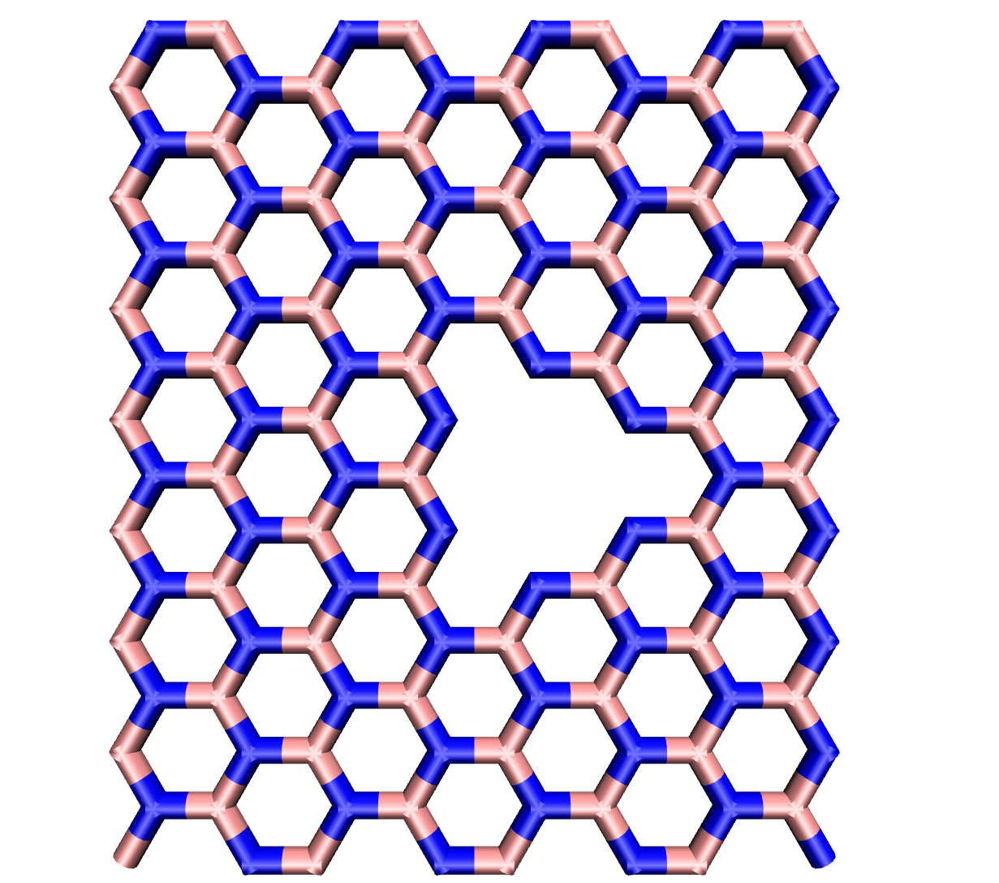

defects
=======

The ``defects`` command currrently only creates holes in
graphene or boronnitride sheets. For graphene the generated pores are circular
while for boronnitride the pores are triangular. The argument ``pore_size=`` 
specifies  the distance between the center of the pore and the border in angstrom.

example builds:

.. code-block:: none

   CONAN-build: build type=graphene
   CONAN-build: defects pore_size=4.3

will yield the following structure:

.. code-block:: none

   CONAN-build: build type=boronnitride
   CONAN-build: defects pore_size=1.0

will yield the following structure:

