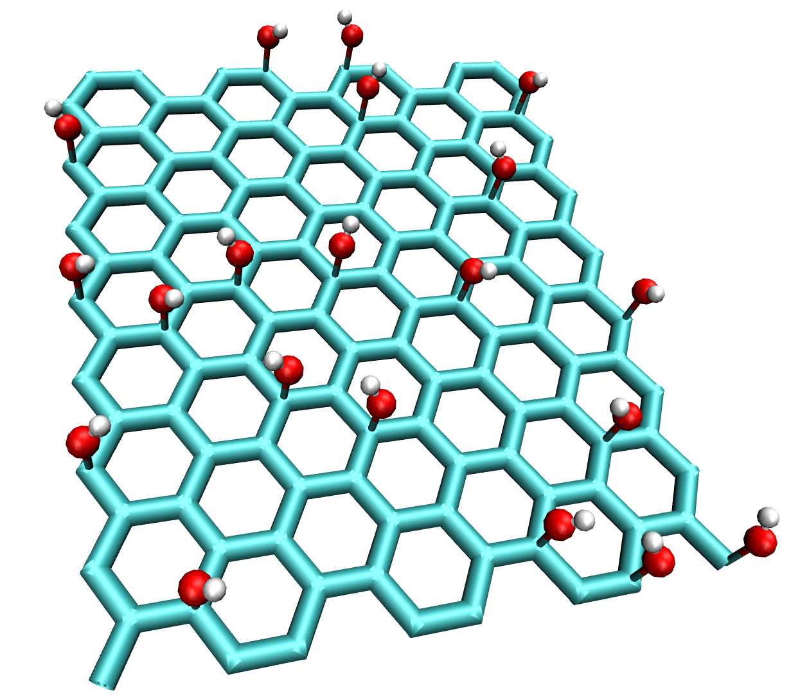

functionalize
=============

The functionalize command is used to place a specified number of functional groups on the structure. Functional groups are
taken from the .xyz files in ``/current_version/build_modules/structure_lib/`` and selected with the ``group`` argument. ``group=OH`` will search for
a file called "OH.xyz" in the ``structure_lib/`` directory and add its contents to the sheet. The number of groups can be adjusted with the ``group_count``
argument. The groups are placed randomly on the sheet. If the added groups should have a ceratin minimal distance from each other, an exclusion radius
can be set using the ``exclusion_radius`` argument.

example build:

.. code-block:: none

   CONAN-build: build type=graphene sheet_size=20.0 20.0
   CONAN-build: functionalize group=OH group_count=20.0 exclusion_radius=2.0

will yield the following structure:

