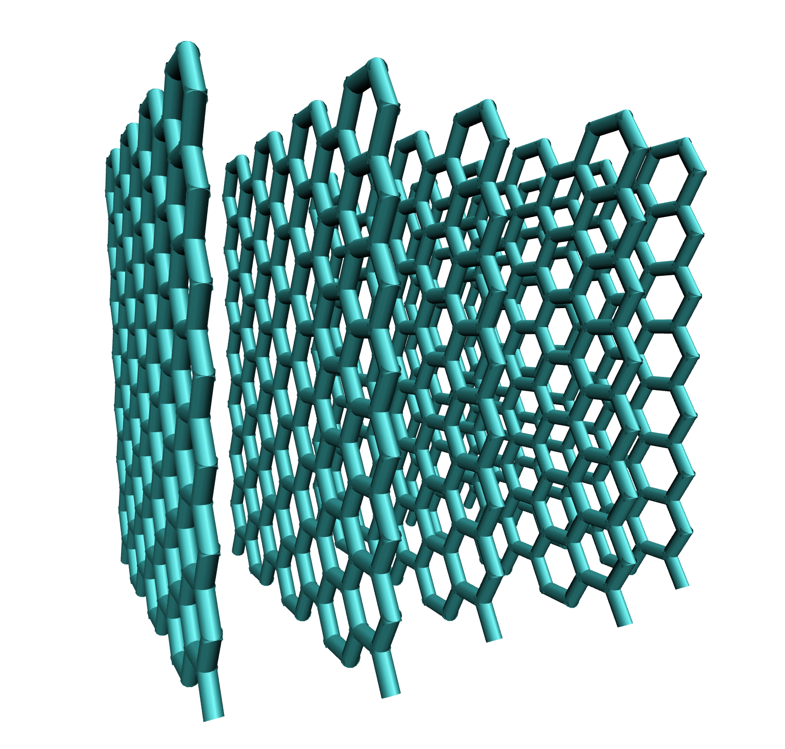
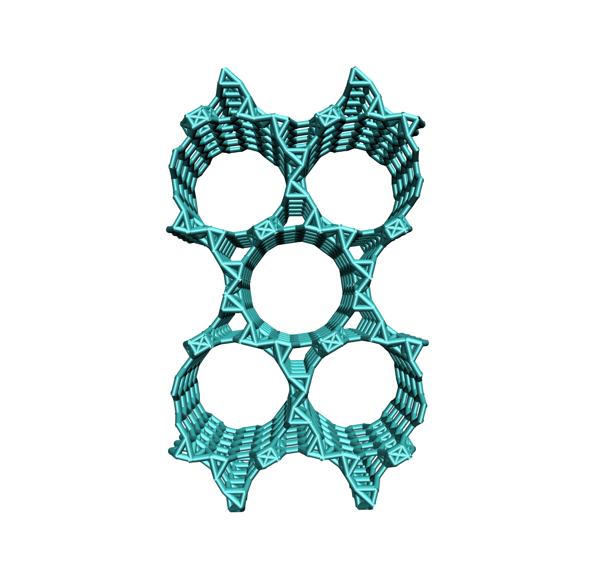

stack
=====

The stack command is used to stack the current structure. The type of stacking depends on the current structure.
Currently available structures:

* graphene/boronnitride (creates a stack of sheets)
* cnt (creates a periodic stack of parallel cnts)
* pore (stacking not available)

depending on which structure is stacked, different arguments and commands for further customization are available:

* ``graphene/boronnitride stacking``

* ``interlayer_spacing=``

the interlayer_spacing arg sets the distance between adjacent sheets Angstrom. the arg requires one floating point value.
example: ``interlayer_spacing=5.0``. The default for graphene is ``interlayer_spacing=3.35``,  the default for boronnitride ``interlayer_spacing=3.5``.
graphene will have ABA stacking and boronnitride will have AA' stacking.

* ``number_of_layers=``

the number_of_layers arg sets the number of sheets that the stack will contain. the arg requires one integer value.
example: ``number_of_layers=5``.

example build:

.. code-block:: none

     CONAN-build: build type=graphene
     CONAN-build: stack interlayer_spacing=5.0 number_of_layers=5

will yield the following structure:

* ``cnt stacking``

cnt stacking will create a periodic boox of parallel cnts

* ``multiplicity=``

the multiplicity arg sets the number of unit cells in x and y directions. the arg requires two integer values.
example: ``multiplicity=2 3``.

* ``tube_distance=``

the tube_distance arg sets the distance between parallel tubes in Angstrom. the arg requires one floating point value.
example: ``tube_distance=1.0``.

example build:

.. code-block:: none

     CONAN-build: build type=cnt armchair tube_size=8 tube_length=10.0
     CONAN-build: stack multiplcity=2 2 tube_distance=1.0

will yield the following structure:

