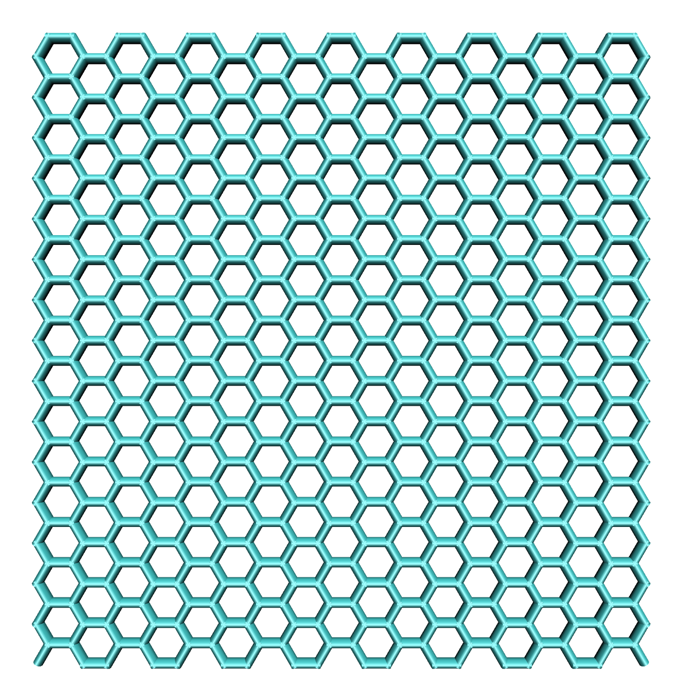

Graphene sheet
==============

* ``sheet_size``

the sheet_size arg sets the dimensions of the sheet in Angstrom. the arg requires two floating point values seperate by a whitespace.
example: ``sheet_size=40.0 40.0``. The default is ``sheet_size=20.0 20.0``.
Keep in mind that the actual sheet size will be lower, since it is determined by the bond_length. The supplied
value represents an upper bound to the size and CONAN will attempt to create the largest possible sheet that fits into these bounds.

* ``bond_length``

the bond_length arg sets the length of the C-C bonds of the sheet. The arg accepts a single floating point value.
example: ``bond_length=1.55``. The default is ``bond_length=1.42``.

example build:

.. code-block:: none

     CONAN-build: build type=graphene sheet_size=40.0 40.0

will yield the following structure:

