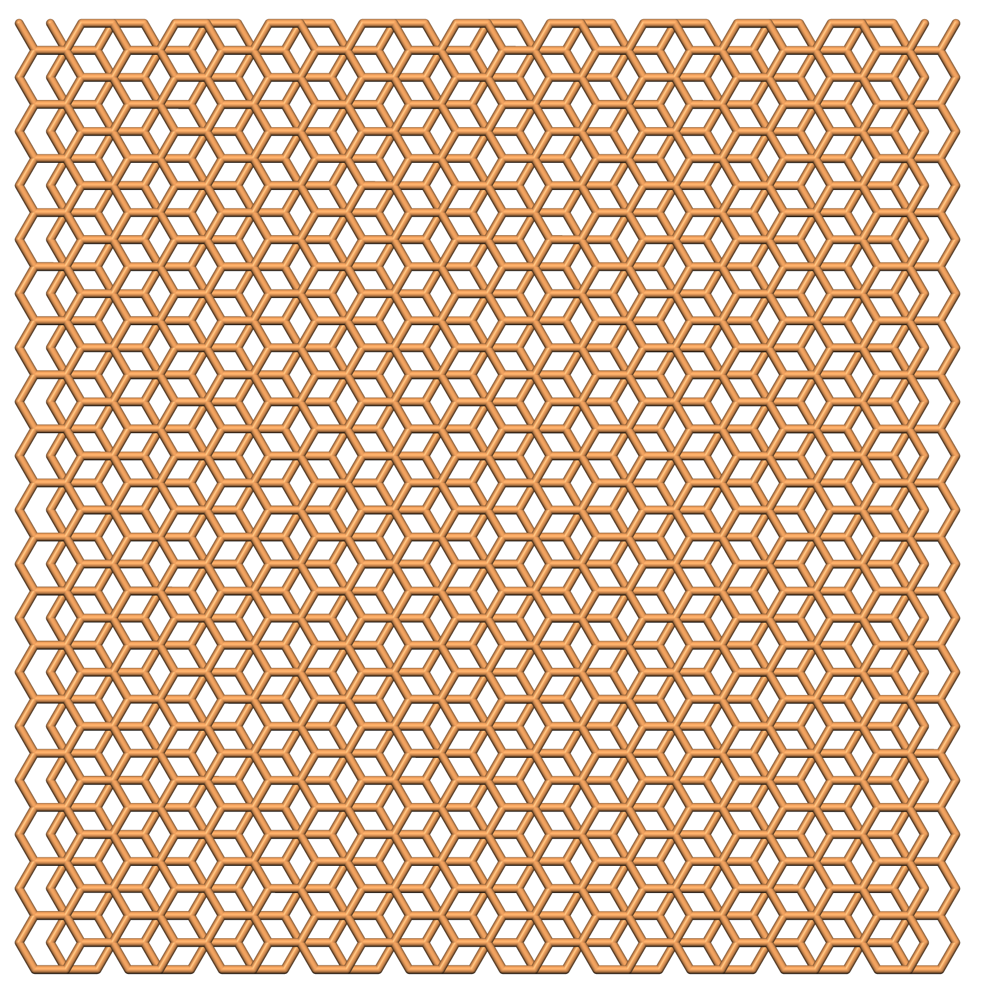
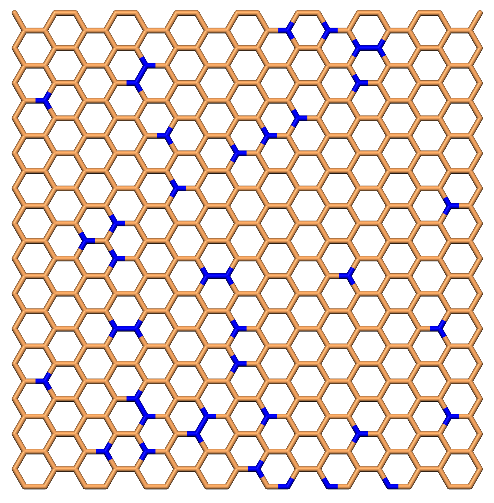
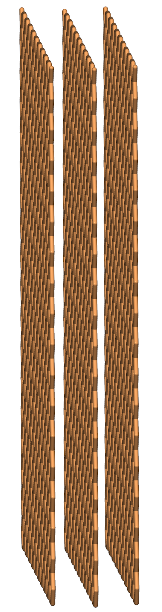
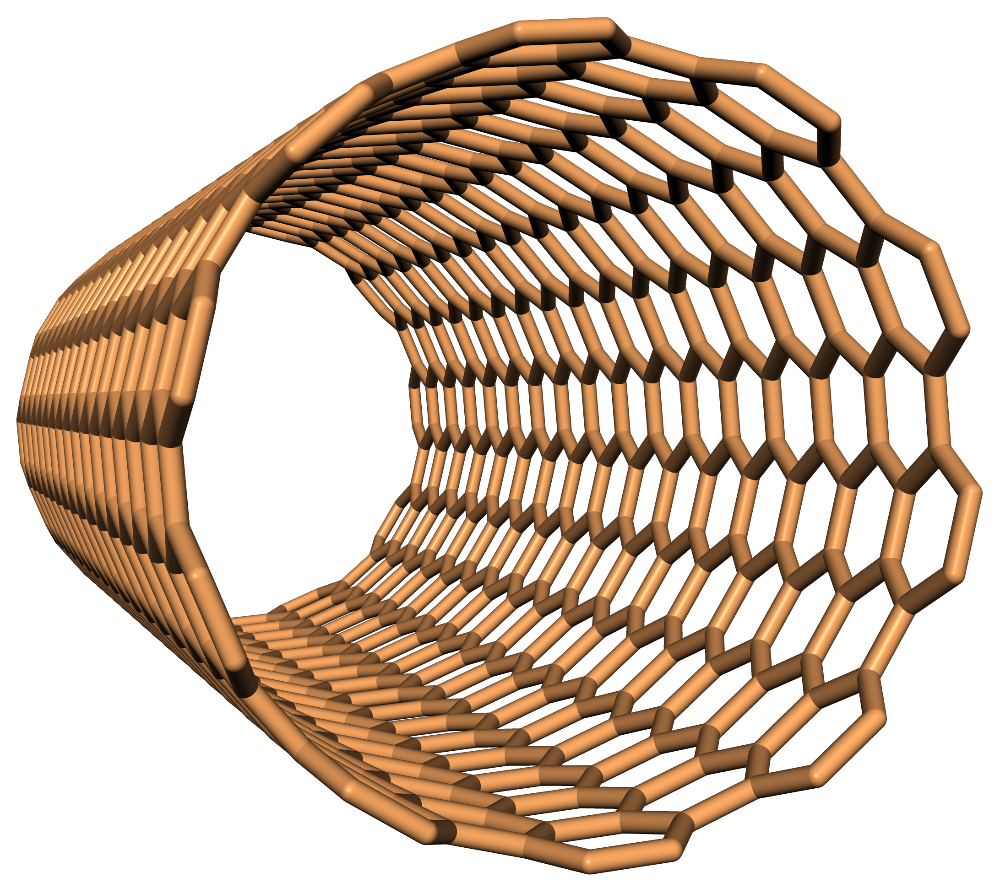
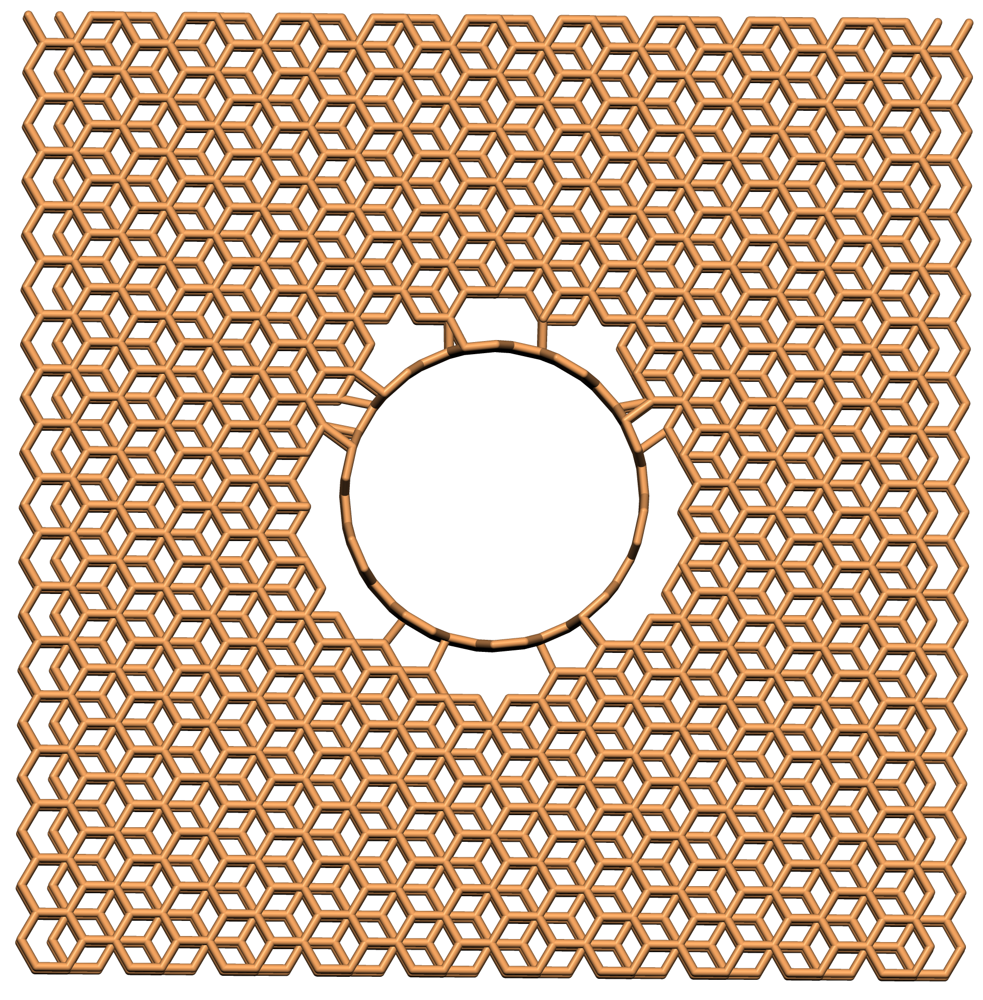
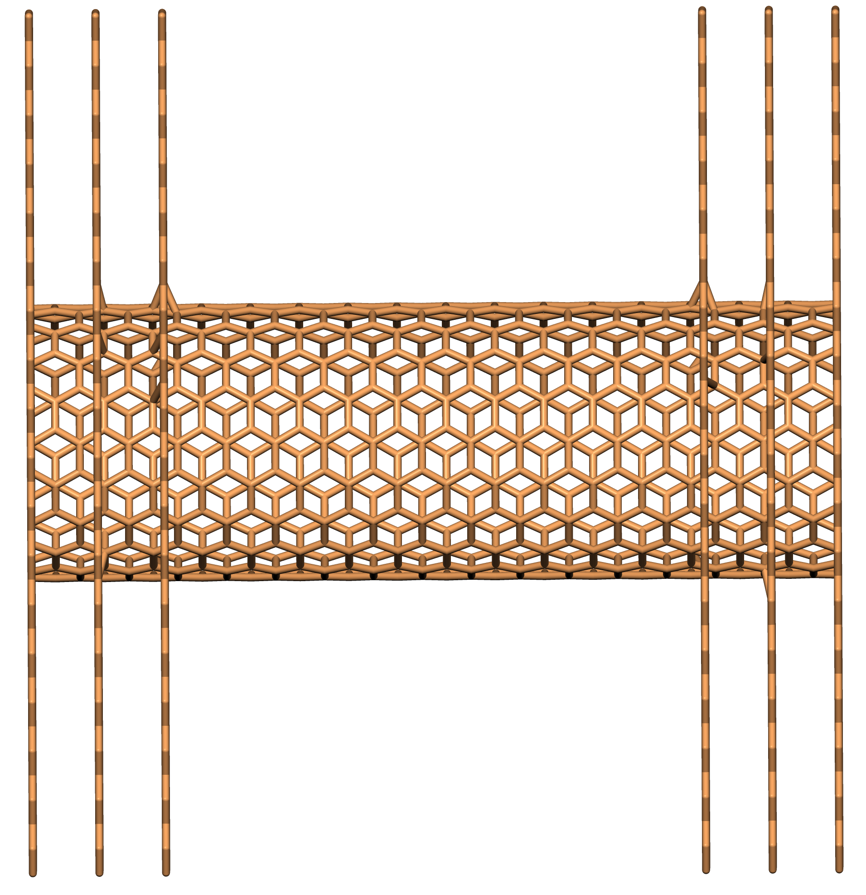

Structures
=================

This mode is automatically started, when the ``-c`` flag is added when starting the program.

.. code-block:: none

    $ python3.10 CONAn.py -c

The mode is used to build carbon and boron nitride structures from scratch and print the xyz structures to a file.

The program can create the following structures:

* Carbon nanotubes (CNTs) and boron nitride nanotubes of arbitrary length and radius in zigzag and armchair conformations.
* Walls of arbitrary size in x and y directions. Multiple layers can be constructed in ABA stacking.
* The CNTs and carbon walls can be combined to form a 'pore' structure. Either as an open tube with walls on both sides, or with the tube closed off on one side, and a wall on the other side.
* Carbon structures can be doped with graphitic nitrogen.
* All structures are designed to satisfy periodic boundary conditions wherever possible.

Structures are built by using the following default parameters:

* Carbon-carbon distance is set to 1.42 Angstroms.
* Interlayer distance between carbon layers is set to 3.35 Angstroms.
  The layers are shifted with respect to each other, resulting in an ABA stacking.
* Boron-nitride distance is 1.44 Angstroms.
* Interlayer distance between boron nitride layers is set to 3.33 Angstroms.
  The positions of all nitrogen and boron atoms are switched in successive layers, resulting in an ABA stacking.

All set values can be freely adjusted by the user.
All relevant values are printed to the terminal and to the ``conan.log`` file. The xyz structures are written to separate files in a ``structures`` folder.

